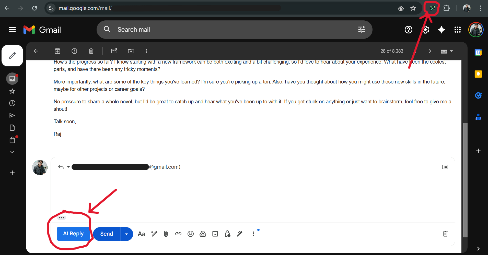

# Reply-Buddy 📧✨


Reply-Buddy is a smart browser extension designed to streamline your email workflow. It analyzes the content of incoming emails and suggests context-aware, professionally toned replies, helping you save time and communicate more effectively.

---

## 📸 Demo

A quick look at Reply-Buddy in action:



---

## ✨ Key Features

* **Contextual Analysis:** Intelligently reads email content to understand the context.
* **AI-Powered Suggestions:** Leverages a powerful language model to generate relevant and human-like reply options.
* **Seamless Integration:** Works as a browser extension that injects itself cleanly into your existing email interface.
* **Java Backend:** Built on a robust and scalable Spring Boot foundation.
* **Modern Frontend:** A responsive and interactive user interface powered by React.

---

## 🛠️ Tech Stack

This project is built with a modern, full-stack architecture:

* **Backend:**
    * Java 17
    * Spring Boot 3
    * Maven for dependency management
* **Frontend (Browser Extension):**
    * React.js
    * Vite as a build tool
    * JavaScript, HTML5, CSS3
* **API Communication:**
    * RESTful APIs

---

## 🚀 Getting Started

Follow these instructions to get a copy of the project up and running on your local machine for development and testing purposes.

### Prerequisites

Make sure you have the following software installed on your system:

* **Java Development Kit (JDK) 17 or later**
* **Apache Maven**
* **Node.js and npm** (Node Package Manager)

### Installation & Setup

1.  **Clone the Repository:**
    ```bash
    git clone [https://github.com/Satyam57/Reply-Buddy.git](https://github.com/Satyam57/Reply-Buddy.git)
    cd Reply-Buddy
    ```

2.  **Configure Environment Variables:**
    The backend requires API keys or other secrets. Create a `.env` file in the root directory and add the necessary variables.
    * Create a file named `.env` in the project root.
    * Add your configuration based on the `.env.example` file (it's a good practice to create one!). For example:
        ```
        API_KEY_FOR_AI_SERVICE="your-secret-key-here"
        SERVER_PORT=8080
        ```

3.  **Set Up the Backend (Spring Boot):**
    Open a terminal in the project root and run the Maven command to build the application and install dependencies.
    ```bash
    # This will compile the code and download all required libraries
    mvn clean install
    ```

4.  **Set Up the Frontend (React):**
    Navigate to the React app's directory and install its npm packages.
    ```bash
    # Go into the React app folder
    cd reply-buddy-react

    # Install dependencies
    npm install
    ```

---

## ▶️ Running the Application

1.  **Run the Backend Server:**
    From the project's root directory, run the following command:
    ```bash
    mvn spring-boot:run
    ```
    Your backend API should now be running on `http://localhost:8080`.

2.  **Run the Frontend Dev Server:**
    In a **new terminal**, navigate to the React directory and start the Vite development server.
    ```bash
    cd reply-buddy-react
    npm run dev
    ```

3.  **Load the Browser Extension:**
    * Open your web browser (e.g., Google Chrome).
    * Go to the extensions page (`chrome://extensions`).
    * Enable **"Developer mode"** using the toggle in the top-right corner.
    * Click on **"Load unpacked"**.
    * Select the `reply-buddy-ext` folder from your project directory.
    * The "Reply-Buddy" extension should now appear in your browser's toolbar!

---

## 📄 License

This project is licensed under the MIT License - see the [LICENSE.md](LICENSE.md) file for details.

## 👤 Contact

Satyam - [Your Email or LinkedIn Profile]

Project Link: [https://github.com/Satyam57/Reply-Buddy](https://github.com/Satyam57/Reply-Buddy)